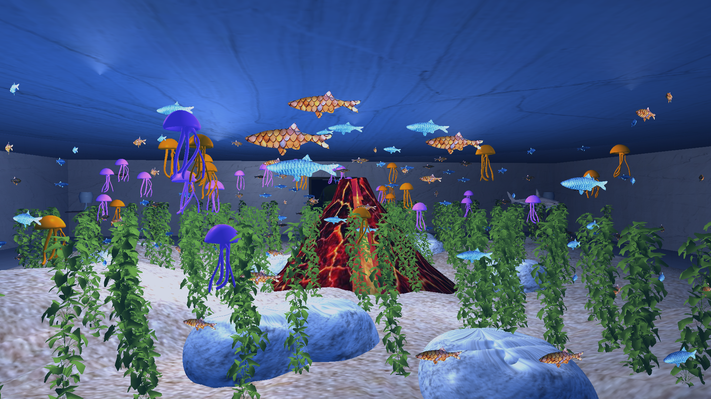
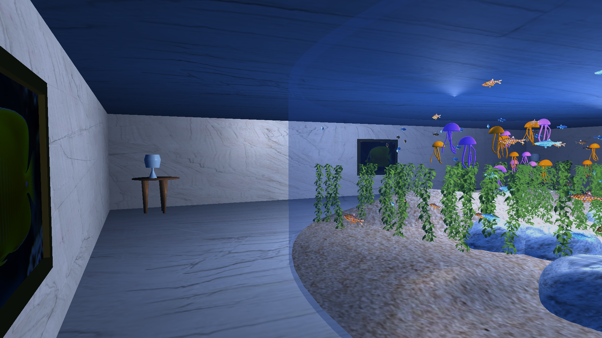

# TCD_ComputerGraphics_Aquarium
This upload forms part of my final project submission for CS7GV6 (Computer Graphics) 2024. My project was entitled "Aquarium Display". 

All code was written in OpenGL C++. All shaders were written in GLSL.

YouTube demonstration video: https://www.youtube.com/watch?v=9CJTs_GUVug

This video begins by demonstrating one of my advanced features: the shark feeding feature where the shark model changes it's route to chase and eat some pellets falling from the roof. This feature is demonstrated once more towards the end of the video. Also included in the video is the implementation of the Phong illumination model, a first person camera implementation, hierarchical kelp animations, multiple instances of textures applied to 3D models, and a variety of other animations unique to the 3D model (e.g. jellyfish bobbing, fish and shark "wagging" swimming movements, etc.).

